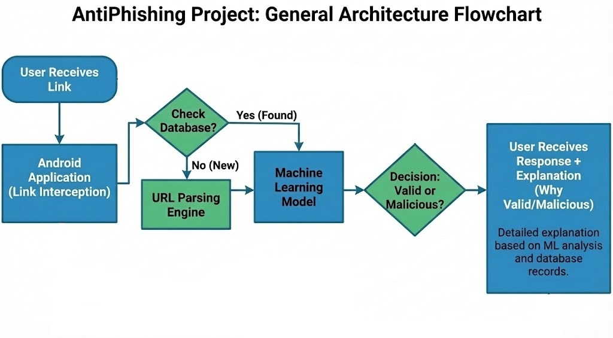

# AntiPhishing

AntiPhishing is a mobile information security project that aims to **identify Phishing links before the user opens them** – in any application (SMS / WhatsApp / Email / Browser) – and display **a risk score in percentage + a clear explanation to the user**

Authors: **Yahav Eliyahu, Ron Golan**

---

## Problem Statement

Phishing attacks are one of the most common and dangerous security problems today. Thousands of users fall for attacks every day that start with a single click on a link that can appear anywhere, whether it's on WhatsApp, SMS, email, or social networks.

The main problem is that phishing doesn't always look dangerous. Sometimes the links look very similar to the original. They can differ by one character, for example, writing paypal with a 1 instead of an l. And sometimes they look really legitimate when the attackers use the names of well-known banks, companies, or services, and so there is no clear sign that it is a scam. Therefore, this phenomenon is really dangerous, especially for adults and people who do not understand technology.

In addition, most of the solutions currently available for phishing are focused on lists of malicious links that are currently known, such as Blacklist and Threat Intelligence database, and therefore do not protect against new links and therefore do not cope well with zero days.

---

## Project Goal

Build a system that provides **Proactive Protection**:
- Show whether the link is **Safe / Suspicious**
- If suspicious: Show **Risk Level in percentage**
- Explain in simple terms why the link seems dangerous to teach the user.
(All before the damage happens, not after).

---

## Key Features

- **Cross-App Protection**: Intercept and analyze links from any application on the device (Intent Filters).
- **On-device fast lexical analysis**: Fast client-side analysis based on URL characteristics (length, special characters, number of subdomains, suspicious TLDs, keywords like login/verify/free, etc.).
- **Server-side ML scoring**: Sending the link to a server-side service (Flask) that calculates additional signals and returns a probability/risk score.
- **Explainable Security**: User-readable explanations (e.g. new domain/suspicious keyword/unusual URL structure).
- **Logging + statistics**: Saving checked links locally and in the cloud to reduce reprocessing + display statistics to the user.

  ---

  

---

## Algorithm

The system operates using a multi-layered pipeline to analyze and classify URLs in real time, in order to protect the user from phishing and other threats. The algorithm flow process is as follows:

1. **URL Interception**
The process is automatically triggered when the user clicks on a link in an external application (such as WhatsApp, SMS, or a browser). The system uses the Android Intent Filter to intercept the address and open as an intermediary before the browser.

2. **Optimization & Normalization**
At this stage, the system prepares the address for efficient and resource-saving comparison:

- **Normalization:** The address is converted to lowercase, tracking parameters are removed, decoding is performed, and the domain is extracted.

- **Cache/DB Lookup:** The system checks whether the normalized address exists in the local database, which contains blacklists and domains from Threat Intelligence databases.

3. **Execution Flow**
Depending on the results of the database check, the algorithm splits into one of two paths:

- **Fast Path (Known Threat):** If the address is in the DB, it is immediately classified as malicious. The system passes it directly to the model for a final risk rating.

- **Deep Analysis Path (Zero-Day Analysis):** If the address is new (not in the DB):

  - The address is first saved in the DB to optimize future queries.

  - The address is passed to the heuristic analysis engine to identify new threats (Zero-Day).

4. **Feature Extraction**
For unknown addresses, the engine calculates statistical features from the URL, including:

- Address length.

- Number of subdomains.

- Lexical analysis: Identifying suspicious keywords (such as login, verify).

- Alpha-numeric ratio.

- Use of special and unusual characters (such as @, %).

5. **Classification & Decision Logic**
The features are fed into a pre-trained machine learning model. The model returns a classification (safe/suspicious) and a risk score.

**Enforcement policy:**

- **Risk score above 80:** The link is defined as dangerous. The system blocks access and displays a security alert to the user with an explanation of the nature of the threat.

- **Otherwise:** The link is defined as safe and the system allows it to be opened in the browser.

---

## Architecture

**Android App**
- Intent Filter interception
- URL normalization & feature extraction
- Local scoring + UI warning screen
- History/logs + statistics

**Backend**
- REST API endpoint for URL scoring
- Feature enrichment (e.g., hostname reputation, WHOIS/domain age if implemented)
- ML model inference + thresholding
- Logging/storage

---

## Research / References

The project relies on a review of Blacklist, Heuristics and ML approaches to identify Phishing URLs, including the use of WHOIS information and feature combinations.

---

## Tech Stack

- **Android**: Kotlin, Intent Filters, UI for warnings/logs
- **Backend**: Flask
- **ML**: URL phishing classification using engineered features (lexical + host-based)
- **Storage**: mongoDB for history and caching

---

## Credits

Project by:

- Yahav Eliyahu

- Ron Golan
